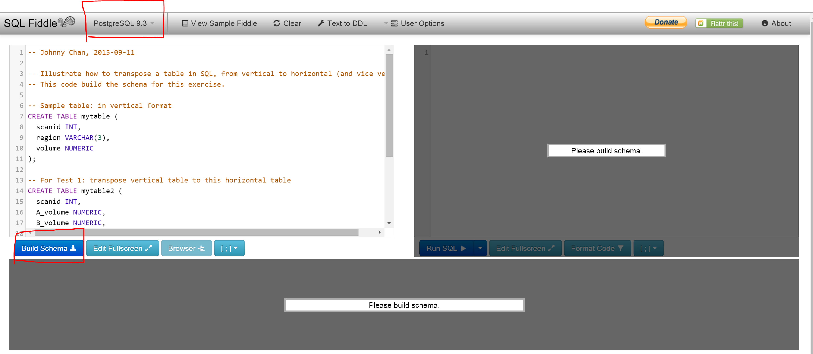
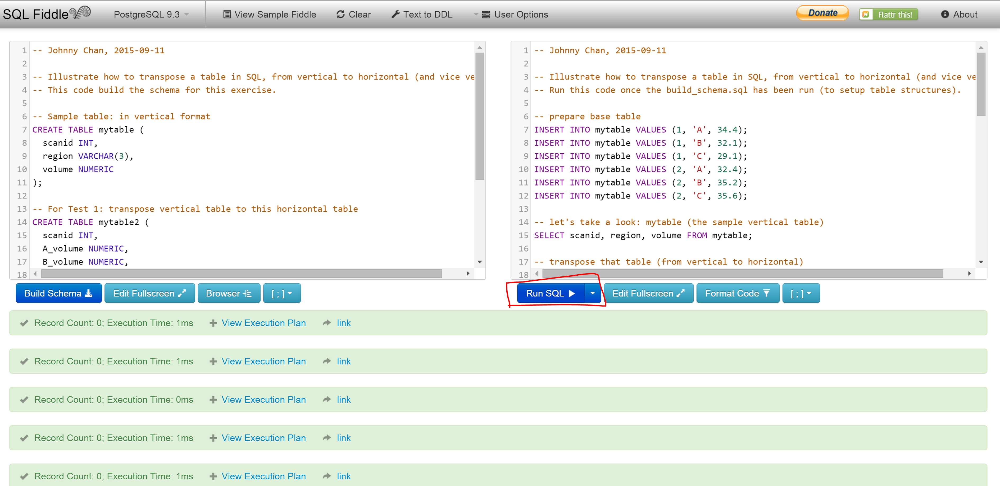
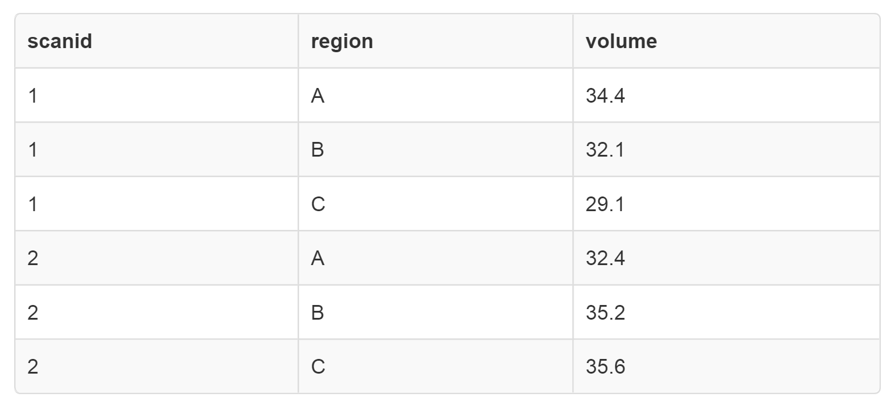
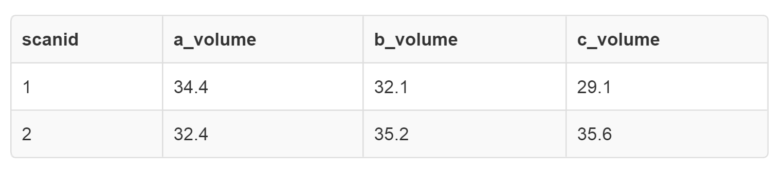
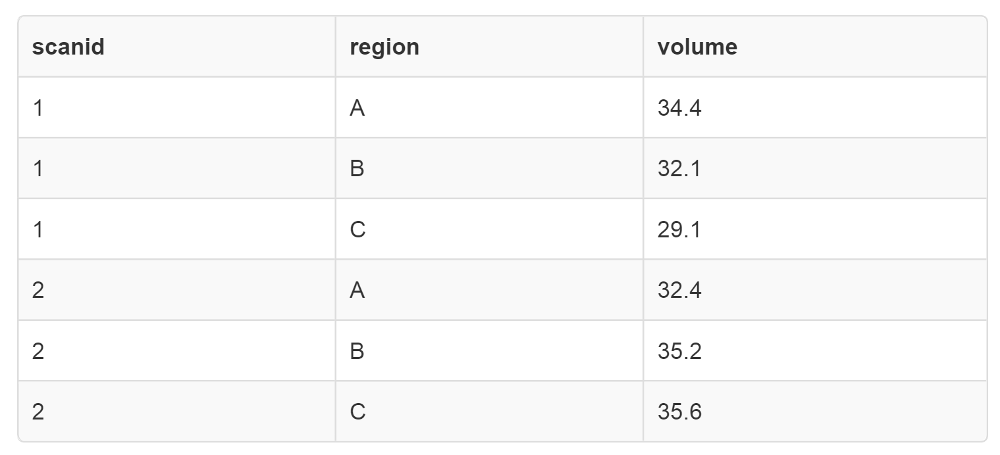

# Intro

This exercise illustrate how to transpose a table in SQL:

- from vertical format to horizontal
- from horizontal format to vertical

This exercise may come in handy for future references. e.g. as a template.

# How to run this test:

Best way to visualize this test is via the [SQL Fiddle Playground](http://sqlfiddle.com/). Make sure to select "PostgreSQL" as the database type.

## Build Schema

Copy the content in `build_schema.sql`, and paste it into the build schema box. then press the "build schema" button to build the schema for:

- `mytable`: a sample vertical format table
- `mytable2`: we will transpose `mytable` into this horizontal table.
- `mytable3': we will transpose `mytable2` into this vertical table.

## Prepare and run the test

Copy the content in `run_transpose_tests.sql`, and paste it into the Run SQL Query Box. Press the "Run SQL Query" button to run the query.

## Output:

`mytable`: a sample vertical format table...

`mytable2`: we have transposed `mytable` into this horizontal table.

`mytable3': we have transposed `mytable2` into this vertical table.

# Conclusion

This exercise helps illustrating a method to perform table transpose in (PostgreSQL) SQL. From vertical table to horizontal table. And vice versa.

# References

These articles really have helped me out big on this.

- [Transposing data in PostgreSQL](http://www.postgresql.org/message-id/000e01c16246$7f1b1a80$1600000a@lrg.office): Provides a good situation where we may want to tranpose a vertical table into a horizontal format. This article has also inspired me to work on a way to transpoe do the vice-versa (e.g. how to tranpose from horizontal back to vertical?)
- [Tips on using SQL INSERT with SELECT](http://www.chesnok.com/daily/2013/11/19/everyday-postgres-insert-with-select/comment-page-1/)
